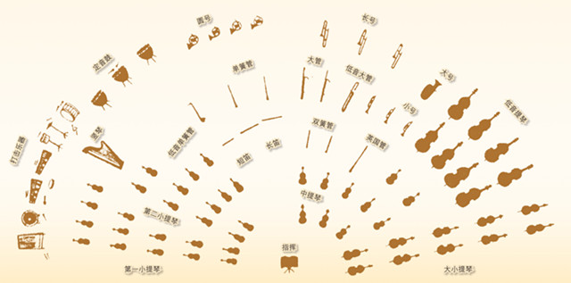
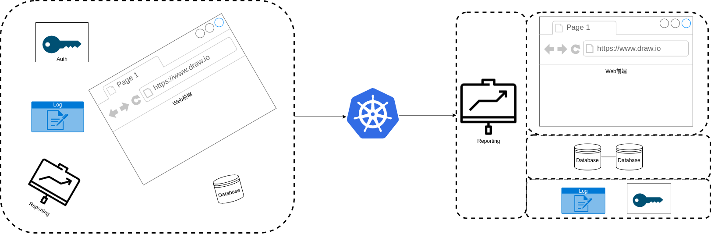
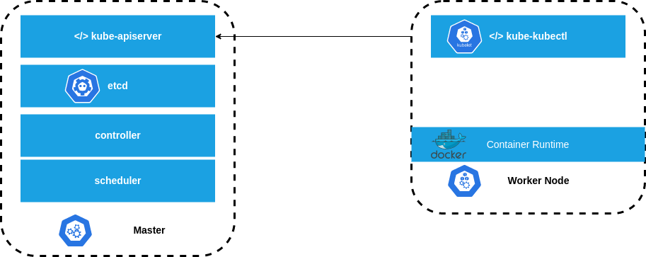

# Getting Started

## Microservices
在單體應用結構(monolithic application)上, 所有的應用功能被綁在同一個package來做開發管理佈署.

也因為相互之間高度耦合(通常是指內容耦合content coupling), 導致無法單獨佈署, 甚至作到擴縮容(scale out/in).
自然沒法達到自治的理想狀態. 

所以微服務(microservices)架構的出現, 就是希望每個功能能拆分成自己負責的小型應用.
彼此透過API/RPC endpoint等的契約(contract)來互通有無, 嘗試降低其耦合程度.

甚至希望每個小型應用都是作為容器(container)形式來開發跟佈署的.

這樣的形式, 能讓每個應用變得更加獨立.
也適合更小[^1]、更專業的開發團隊來進行開發跟迭代功能.

也因為耦合程度降低了, 就能開發成獨立的小型服務去佈署, 也能再不影響系統其他應用下去進行佈署．更新、擴縮容等管理機制.


## Cloud-native
### Cloud-native v.s. Cloud-based v.s. Cloud-enabled
一堆名詞, 巴拉巴巴巴[^2]
#### Cloud-enabled
就把地端的Monolithic application, 原封不動的搬到雲上, 租用個VM, 好一點的連資料庫也搬到雲上, 架構保持不變.

通常這是把老系統慢慢上雲, 最先進行的第一步.

#### Cloud-based
雲平台提供的功能, 或者是把我們開發的應用, 給雲做託管.

像把應用程式佈署到AWS Lambda, GCP Cloudrun
但可能資料庫還是在地端的機房內, 通常資料要保留在本地地端, 是為了一些合規性安全性的考量.


### Cloud-native
Cloud-native用來表示已經包裝好容器的(containerize)應用、服務等.
換句話說, 直接就能透過CI/CD, 來佈署在各種類型的雲上, 成為一個新的服務.[^3]

一個cloud-native應用通常能夠
- 按需擴縮容
- 自我自治,修復
- 支持零停機時間滾動更新
- 可以在任何有Kubernetes的地方運行

按需擴縮容是指應用程式與相關的基礎建設能按照需求自動擴容與縮容的能力.
K8S有這樣的能力, 能在需求增加時自動對應應用程式與基礎建設進行擴容, 
並在需求下降時自動縮容.

自我自治,修復; 我們在佈署到K8S時, 需要告訴K8S該應用長怎樣?
幾個實例, 連接到哪些網路都宣告清楚了! 
K8S會把這些保存為期望狀態(desired state)[^4], 並監視著, 確保它始終跟期望狀態匹配.
只要有實例 巴比Q了, K8S就會知道並啟動一個副本來替代它, 這就是自我修復.

零停機時間滾動更新(Zero downtime deployment)講的是可以逐步更新新版本的應用上去, 而不用把正在服務的節點進行關閉. [^5]
這樣客戶端都不會注意到, 系統整體依然保持著可用的狀態.
要是公司有簽約, 一年可用性的SLA需要達到99.99%好了.
表示一年中要有99.99%時間正常營運
> (60s * 60m * 24hr * 365d) * 99.99% = 31532846.4s  
> 換言之, 無法提供服務的時間只有(60s * 60m * 24hr * 365d) * 0.01% = 3153.6s = 52分鐘33.6秒

要是您的服務跟基礎建設能達到零停機時間滾動更新, 這樣這52分鐘就不會浪費在版本更新上了.


可以在任何有Kubernetes的地方運行這特點就廢話了.
K8S能在各種雲上, 也能在本地, 甚至在樹莓派叢集上[^6].

## Orchestrator

上面講了一些特性, 如果沒有個編排器(Orchestrator), 都要自幹, 是很容易出錯的.
最後管理上就一團糟, 這也是為什麼微服務架構剛起來時, 很多人照做之後, 但管理跟佈署上碰到很多的麻煩.

Cloud-native的應用就很像是一個管弦樂團

編排器就像個指揮, 指揮著一切, 告訴每組樂器什麼時候演奏, 怎樣的速度演奏.

K8S就是這邊排器指揮的角色, 把一組微服務相關的應用聚集在一起, 並且組織起來成一個能創造價值的應用.
包含前面提到的擴縮容、自我修復、滾動更新都是由它負責指揮.


從K8S的Icon來看, 是個輪舵.
Kubernetes在希臘雨中的意思是舵手, 掌握舵的人.[^7]

K8s是我們常用的縮寫, 這個```8```表示的是K與s之間有8個字母.

## K8S Architecture
- Nodes (Minions)
- Custer
- Master
- Components[^8]
  - API Server
  - etcd
  - Kubelet
  - Container Runtime
  - Controller
  - Scheduler

  

## Minikube
單機的Kubenetes, 讓我們萌新者學習使用

## References
[^1]: [Two Pizza Team Rule](https://docs.aws.amazon.com/whitepapers/latest/introduction-devops-aws/two-pizza-teams.html)  
[^2]: [Cloud-Based, Cloud-Native, and Cloud-Enabled Applications—What’s the Difference?](https://www.papertrail.com/solution/tips/cloud-based-cloud-native-and-cloud-enabled-applications-whats-the-difference/)  
[^3]: [CNCF Cloud-Native DEfinition](https://github.com/cncf/toc/blob/main/DEFINITION.md)
[^4]: [Understanding Kubernetes Objects](https://kubernetes.io/docs/concepts/overview/working-with-objects/kubernetes-objects/)
[^5]: [Performing a Rolling Update](https://kubernetes.io/docs/tutorials/kubernetes-basics/update/update-intro/)
[^6]: [Creating a Raspberry Pi cluster running Kubernetes](https://kubernetes.io/blog/2015/11/creating-a-raspberry-pi-cluster-running-kubernetes-the-shopping-list-part-1/)
[^7]: [Kubernetes歷史](https://zh.wikipedia.org/zh-tw/Kubernetes#%E5%8E%86%E5%8F%B2)
[^8]: [K8s Components](https://kubernetes.io/docs/concepts/overview/components/)