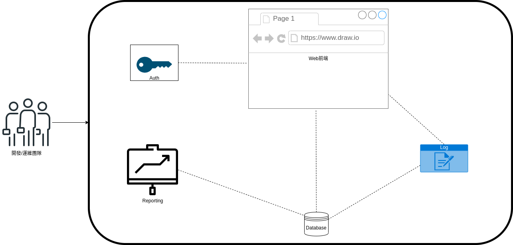

# Getting Started

## Microservices
在單體應用結構(monolithic application)上, 所有的應用功能被綁在同一個package來做開發管理佈署.

也因為相互之間高度耦合(通常是指內容耦合content coupling), 導致無法單獨佈署, 甚至作到擴縮容(scale out/in).
自然沒法達到自治的理想狀態. 

所以微服務(microservices)架構的出現, 就是希望每個功能能拆分成自己負責的小型應用.
彼此透過API/RPC endpoint等的契約(contract)來互通有無, 嘗試降低其耦合程度.

甚至希望每個小型應用都是作為容器(container)形式來開發跟佈署的.

這樣的形式, 能讓每個應用變得更加獨立.
也適合更小[^1]、更專業的開發團隊來進行開發跟迭代功能.

也因為耦合程度降低了, 就能開發成獨立的小型服務去佈署, 也能再不影響系統其他應用下去進行佈署．更新、擴縮容等管理機制.

## Cloud-native
### Cloud-native v.s. Cloud-based v.s. Cloud-enabled
#### CLoud-enabled
就把地端的Monolithic application, 原封不動的搬到雲上, 租用個VM, 好一點的連資料庫也搬到雲上, 架構保持不變.

通常這是把老系統慢慢上雲最先進行的第一步.

## Orchestrator
## K8S Architecture

## References
[^1]: [Two Pizza Team Rule](https://docs.aws.amazon.com/whitepapers/latest/introduction-devops-aws/two-pizza-teams.html)  
[^2]: [Cloud-Based, Cloud-Native, and Cloud-Enabled Applications—What’s the Difference?](https://www.papertrail.com/solution/tips/cloud-based-cloud-native-and-cloud-enabled-applications-whats-the-difference/)