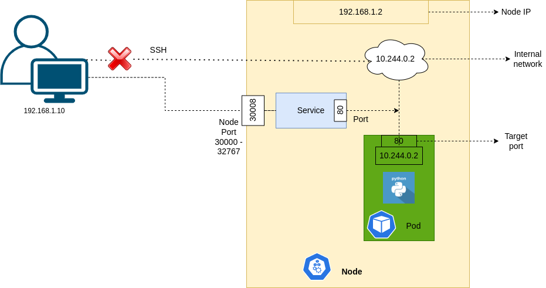

# 學習 k8s Networks 與 Service

## k8s Network 概念


1. k8s 最小的 IP resource 單位是 Pod
2. k8s 本身並無實作關於 Network 的設定

只定義所有實作 Network 的 Provider 需要符合以下兩個要求

* 在 k8s cluster 內所有 containers/Pods 彼此間溝通不需要透過 NAT[^2]
* 在 k8s cluster 內所有 Nodes 與 container 彼此間溝通不需要透過 NAT[^2]

```yaml
apiVersion: v1
kind: Service
metadata:
  name: myapp-service
spec:
  type: NodePort
  ports:
    - targetPort: 80
      port: 80
      nodePort: 30008
  selector:
    # Pod's metadata
```

## k8s Service[^1]


### NodePort

#### Concept Map


#### k8s Object
```yaml=
apiVersion: v1
kind: Service
metadata:
  name: myapp-service
spec:
  type: NodePort
  ports:
   - port: 80 # service port
     targetPort: 8080 # container port
     nodePort: 30004 # range in 30000 ~ 32767
  selector:
    name: myapp # for match pod
```
#### Multiple Node


### ClusterIP

#### k8s Object
```yaml=
apiVersion: v1
kind: Service
metadata:
  name: backend # could access use this name as dns
spec:
  type: ClusterIP
  ports:
   - port: 80 # service port
     targetPort: 80 # container port
  selector:
    name: myapp # for match pod
```


#### Usage

1. k8s Service 預設的 Type
2. 用來讓所有 Pod 可以透過單一網路存取介面讓其他 cluster 內的 Pod 存取
3. Service 的 name 可以當作 dns name 在 cluster 內使用

### LoadBalancer

#### Concept


#### 使用情境

1. 需要透過 Domain Name 的方式提供服務給外部使用來者使用時
2. 需要在有 cloud provider 支援的情況下才能用
3. 如果在不支援的環境使用效果會跟 NodePort 一樣

#### k8s Object
```yaml=
apiVersion: v1
kind: Service
metadata:
  name: backend # could access use this name as dns
spec:
  type: LoadBalancer
  ports:
   - port: 80 # service port
     targetPort: 80 # container port
     nodePort: 30004 # range in 30000 ~ 32767
  selector:
    name: myapp # for match pod
```
### ExternalName[^3]

#### Usage

1. 把 Service 對應到一個 DNS name
2. 不同於其他 Service，需要指定一個 externalName 來指定對應的 DNS name
#### k8s Object
```yaml=
apiVersion: v1
kind: Service
metadata:
  name: my-service
  namespace: prod
spec:
  type: ExternalName
  externalName: my.database.example.com
```

## 實際案例

### Deployment
myapp-deployment.yaml
```yaml=
apiVersion: apps/v1
kind: Deployment
metadata:
  name: myapp-deployment
spec:
  selector:
    matchLabels:
      app: myapp
  replicas: 6
  template:
    metadata:
      name: nginx
      labels:
        app: myapp
    spec:
      containers:
      - name: nginx
        image: nginx
```

### Service
myapp-service.yaml
```yaml=
apiVersion: v1
kind: Service
metadata:
  name: myapp-service
spec:
  type: NodePort
  ports:
    - port: 80
      targetPort: 80
      nodePort: 30004
  selector:
    app: myapp
```

### 建立 Deployment 與 Service

```shell=
kubectl create -f myapp-deployment.yaml
kubectl create -f myapp-service.yaml
```

透過 minikube 察看 node port url

```shell=
minikube service myapp-service --url
```

## References

[^1]: https://kubernetes.io/docs/concepts/services-networking/service/

[^2]: https://zh.wikipedia.org/zh-tw/%E7%BD%91%E7%BB%9C%E5%9C%B0%E5%9D%80%E8%BD%AC%E6%8D%A2

[^3]: https://kubernetes.io/docs/concepts/services-networking/service/#externalname